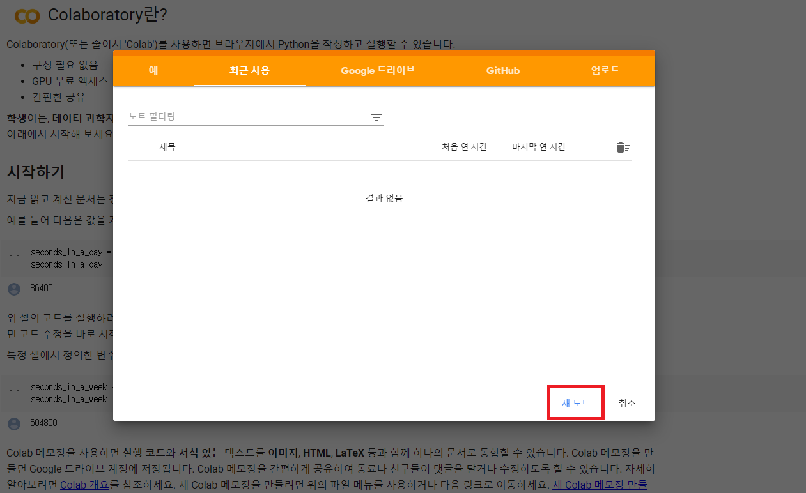

# CUDA on Google Colab setup

원문: [https://medium.com/@harshityadav95/how-to-run-cuda-c-or-c-on-google-colab-or-azure-notebook-ea75a23a5962](https://medium.com/@harshityadav95/how-to-run-cuda-c-or-c-on-google-colab-or-azure-notebook-ea75a23a5962)

안내영상 [[Link](https://www.youtube.com/watch?v=_cTG9_f67y8&feature=youtu.be)]

## 1. Colab 프로젝트 생성

[https://colab.research.google.com](https://colab.research.google.com/) 에 접속하여 "새 노트"를 눌러 프로젝트를 생성한다.



## 2. 런타임 유형 GPU로 변경

런타임 → 런타임 유형변경→ 하드웨어 가속기를 GPU로 변경


## ~~3. COLAB의 CUDA 제거~~

CUDA를 재설치하지 않아도 정상적으로 동작하는 것이 확인 되었습니다. 3,4번은 넘어가셔도 됩니다. (정상적으로 작동하지 않을 경우 시도해보시기 바랍니다.)

아래 코드를 한줄씩 실행한다.

한 코드 블럭에 한줄의 코드만 실행해야 한다.

코드블럭은 +코드를 눌러서 추가할 수 있으며, 실행버튼을 눌러 코드를 실행한다.

```bash
!apt-get --purge remove cuda nvidia* libnvidia-*
```

```bash
!dpkg -l | grep cuda- | awk '{print $2}' | xargs -n1 dpkg --purge
```

```bash
!apt-get remove cuda-*
```

```bash
!apt autoremove
```

```bash
!apt-get update
```


## ~~4. CUDA 설치~~

CUDA를 재설치하지 않아도 정상적으로 동작하는 것이 확인 되었습니다. 3,4번은 넘어가셔도 됩니다. (정상적으로 작동하지 않을 경우 시도해보시기 바랍니다.)

3)과 마찬가지로 아래 코드를 한줄씩 실행한다.

```bash
!wget https:*//developer.nvidia.com/compute/cuda/9.2/Prod/local_installers/cuda-repo-ubuntu1604-9-2-local_9.2.88-1_amd64 -O cuda-repo-ubuntu1604-9-2-local_9.2.88-1_amd64.deb*
```

```bash
!dpkg -i cuda-repo-ubuntu1604-9-2-local_9.2.88-1_amd64.deb
```

```bash
!apt-key add /var/cuda-repo-9-2-local/7fa2af80.pub
```

```bash
!apt-get update
```

```bash
!apt-get install cuda-9.2
```

## 5. CUDA 설치 확인

설치가 완료됬으면 아래 코드로 제대로 설치되었는지 확인한다.

```bash
!nvcc --version
```


## 6. 노트 확장프로그램 설치

아래 코드로 주피터 노트북 확장프로그램을 설치한다.

```bash
!pip install git+git://github.com/andreinechaev/nvcc4jupyter.git
```

```bash
%load_ext nvcc_plugin
```


## 7. 컴파일

아래 CUDA C 코드를 입력하여 컴파일하고 실행해본다.

%%cu를 반드시 붙여야한다.

```cpp
%%cu
#include <stdio.h>
#include <stdlib.h>
__global__ void add(int *a, int *b, int *c) {
*c = *a + *b;
}
int main() {
int a, b, c;
// host copies of variables a, b & c
int *d_a, *d_b, *d_c;
// device copies of variables a, b & c
int size = sizeof(int);
// Allocate space for device copies of a, b, c
cudaMalloc((void **)&d_a, size);
cudaMalloc((void **)&d_b, size);
cudaMalloc((void **)&d_c, size);
// Setup input values  
c = 0;
a = 3;
b = 5;
// Copy inputs to device
cudaMemcpy(d_a, &a, size, cudaMemcpyHostToDevice);
  cudaMemcpy(d_b, &b, size, cudaMemcpyHostToDevice);
// Launch add() kernel on GPU
add<<<1,1>>>(d_a, d_b, d_c);
// Copy result back to host
cudaError err = cudaMemcpy(&c, d_c, size, cudaMemcpyDeviceToHost);
  if(err!=cudaSuccess) {
      printf("CUDA error copying to Host: %s\n", cudaGetErrorString(err));
  }
printf("result is %d\n",c);
// Cleanup
cudaFree(d_a);
cudaFree(d_b);
cudaFree(d_c);
return 0;
}
```


## 8. hello world 출력

아래 코드로 Hello world도 출력해본다.

```cpp
%%cu
#include <iostream>
int main(){
    std::cout << "hello world"<<std::endl;
}
```